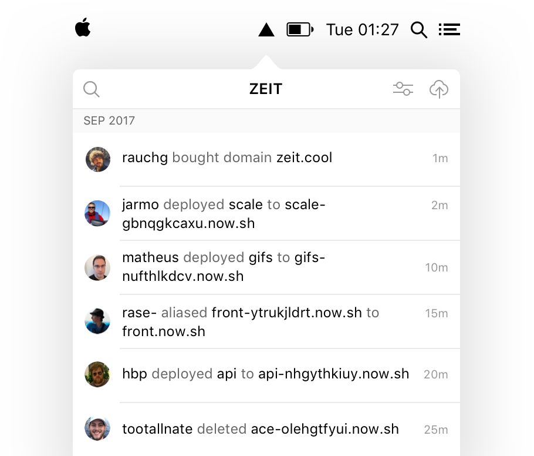
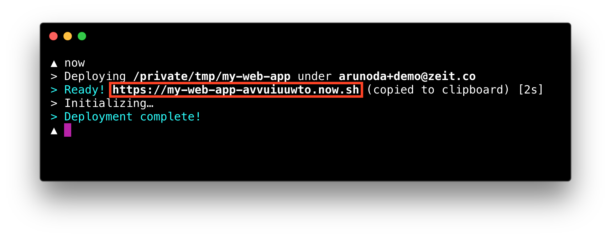
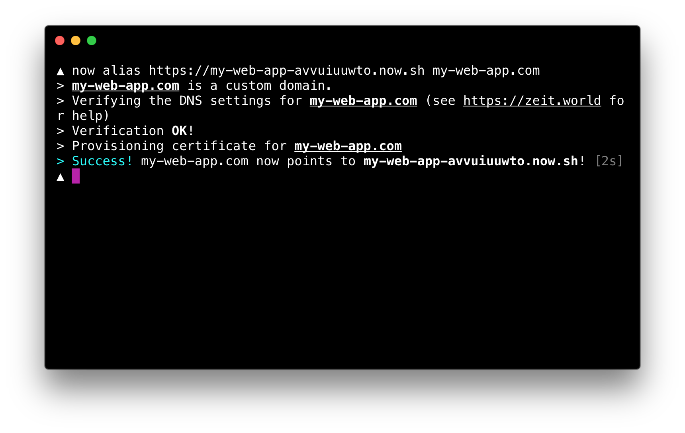

[Zeit 홈페이지](https://zeit.co/)


# Intro

```shell
~/my-app $ now
> Deploying...
> Ready!
```

Instant Global Deployments

단 한 줄의 명령어로 전 세계에서 가장 강력한 서버없는 플랫폼에 배포하세요.


## 서버가 아닌 프로덕트에만 집중하세요.

```js
~/my-app $ ls
package.json	index.js	lib		static
~/my-app $ now
> Ready! https://my-proj-hj1v2m.now.sh
(copied to clipboard) [440ms]
> Upload [=====================] 100% 5.7s
> Sync complete (1.38MB) [4759ms]
```

우리의 애플리케이션을 설치하고 모든 플랫폼에서 쉽게 배포하세요.

- 원하는 프로그래밍 언어나 프레임워크에서 코드를 작성하세요.
- 노력없이 무한히 확장하세요.
- 마이크로 서비스로 API를 구성하고 나중에 [합치세요](https://zeit.co/docs/features/path-aliases).


## 전체 구성원들을 하나의 워크플로우로 모으세요.



실시간으로 협업하여 배포하세요.

- 팀의 활동들을 즉시 시각화하세요.
- 배포, DNS 기록, 인증 - 모든 것을 한 곳에서
- 플랜을 구매하거나 온디맨드를 결제하세요.


## 계속 반복할 수 있습니다. 제한 없이. 끊김없이.

Now Alias를 만나세요. 서비스 중단 없이 계속 업그레이드 할 수 있습니다.

```shell
~/my-app $ now alias my-app-h3o2mc.now.sh my-app.com
> my-app.com is a custom domain
> Verifying the DNS settings for my-app.com
> Detected zeit.world nameservers! Configuring records...
> DNS Configured! Verifying propagation...
> Verification OK!
> Provisioning certificate for my-app.com
> Success! my-app.com now points to my-app-hei2m.now.sh!
```


## 자동으로 보안을 지킵니다.

**SSL 인증서**를 자동으로 제공하고 갱신합니다.

[Let's Encrypt](https://letsencrypt.org/) 덕분에 원하는 만큼 여러 도메인에 무료로 보안을 지킬 수 있습니다.


## 완전히 프로그래밍적입니다.

우리의 가장 단순하고 강력한 [API](https://zeit.co/api)는 이미 사용하는 스택이나 클라우드에 통합될 수 있습니다.

CI 파이프라인을 통합하세요. UI와 비즈니스에 필요한 워크플로우를 구현하세요.


## 한계가 없습니다.

모든 변경 사항을 코드에 배치할 수 있습니다. 그런 다음 유저가 사용하는 도메인과 API가 어느 것과 연견되는지 결정하세요. 무언가 잘못되었나요? **같은 명령어로 롤백하세요!**


## zeit.world - 자유로운 글로벌 DNS

DNS와 기록 수정, CNAME 혹은 ALIAS에 대해 걱정할 필요가 없습니다. `now alias`를 실행하여 여러분의 배포를 기억할 수 있는 도메인이나 서브 도메인에 연결하세요. 배포, 스테이징, 프로덕션 모두 한 곳에서.


# About

## 우리의 미션

모바일 컴퓨팅만큼 쉽고 접근하기 편한 클라우드 컴퓨팅을 만드는 것.

개발자와 디자이너들을 위한 프로덕트를 구현합니다. 그리고 그것들이 하나가 되기를 바라는 사람들입니다.

- **쉽다**: 진짜 쉽도록 클라우드 컴퓨팅이 탭이나 명령어만큼 쉬워야 합니다.
- **누구나 쓸 수 있다**: 모두가 연결되도록 애플리케이션은 모든 지역에서 빨라야 합니다.
- **접근하기 쉽다**: 접근하기 쉬울 수 있도록 유저 경험과 디자인을 신경써야 합니다.


---


## 문서

### 시작하기

#### 5분 가이드

Now의 도움으로 여러분은 5분 안에 모든 웹 애플리케이션 혹은 서비스를 배포하고 출시할 수 있습니다.

이 가이드는 애플리케이션을 배포하고 원하는 도메인 이름에 연결하고 SSL 인증서를 구성하는 방법을 보여줍니다.

##### Now Desktop 설치하기

여러분의 디바이스에서 Now를 시작하는 가장 좋은 방법은 메뉴바에서 동작하는 미니멀한 애플리케이션 [Now Desktop](https://zeit.co/download)입니다. 다음과 같은 기능들을 제공합니다.

- [Now CLI](https://zeit.co/download#command-line)를 설치하고 자동으로 최신상태로 유지합니다. (Now와 상호작용하는 명렁어 인터페이스)
- 여러분의 계정과 함께하는 팀들의 활동들의 실시간 피드를 제공합니다.
- 파일을 메뉴바 아이콘으로 간단하게 드래그 앤 드롭하거나 파일 피커를 사용해 선택하여 원하는 모든 종류의 애플리케이션을 배포합니다.

##### 가입하기

[Now Desktop](https://zeit.co/download) 다운로드가 완료되면 파일을 실행시키고 지시를 따르세요.

가입 절차가 완전히 끝난 후에는 계정의 이벤트 피드가 안에 보입니다.

##### 배포

로그인을 했다면 간단한 정적 웹사이트 배포를 시작해봅시다.

먼저 `my-web-app` 디렉터리를 생성하고 다음과 같은 내용의 `index.html` 파일을 추가합니다.

```Html
<!DOCTYPE html>
<html>
  <body>
    This is a static web app.
  </body>
</html>
```

> 간단한 정적 애플리케이션 대신에 [Node.js](https://github.com/now-examples/nextgram) 애플리케이션이나 [Dockerfile을 이용한](https://github.com/now-examples/cobol-hello-world) 애플리케이션을 사용할 수 있습니다.

파일을 추가한 후 터미널에서  `my-web-app` 디렉터리로 접근하여 이 명령어를 실행하세요.

```shell
$ now
```

Now는 애플리케이션을 배포하고 아래처럼 보이는 것처럼 URL를 제공합니다.



배포 후 유니크 URL를 제공합니다.

현재 애플리케이션 배포의 URL입니다. 이 URL을 통해 언제든지 앱의 지금 버전에 접근할 수 있습니다.

##### 도메인 이름

이제 여러분의 애플리케이션에 접근할 수 있는 유니크 URL이 있습니다. 하지만 유저들이 여기에 직접 접근하기에는 구리게 생겼습니다. 다음 스텝에서 여러분이 원하는 도메인 이름을 "now.sh" URL에 연결시켜봅시다.

도메인 이름이 `my-web-app.com`라고 가정해봅시다. 아직 이 도메인을 구매하지는 않았습니다.

애플리케이션의 유니크 URL에 도메인 이름을 연결시키기 위해 이 명령어를 실행해주세요.

```shell
$ now alias https://my-web-appasefsej.now.sh my-web-app.com
```

도메인 이름을 아직 구매하지 않았기 때문에 여러분은 신용 카드 정보를 입력하라고 요청받을 것입니다. 다음의 명령어를 실행하여 입력할 수 있습니다.

```shell
$ now cc add
```

다음 명령어를 실행시켜 "Premium" 플랜을 여러분의 계정에서 업그레이드 시킬 수 있습니다.

```shell
$ now upgrade	
```

이제 다시 도메인을 연결시키는 명령어를 실행하고 다음 지시를 따르세요.

```Shell
$ now alias https://my-web-app-avvuiuuwto.now.sh my-web-app.com
```

완료되었다면 [https://my-web-app.com](https://my-web-app.com/)으로 여러분의 애플리케이션에 접근할 수 있습니다. 자동으로 [Let's Encrypt](https://letsencrypt.org/)를 사용하여 SSL 인증서를 설정하고 HTTPS를 제공합니다.



##### 업데이트

애플리케이션에 변화가 생겼다면 여러분의 애플리케이션의 마지막 버전을 배포해야합니다. 이를 위해 다음 명령어를 실행해주세요.

```shell
$ now
```

이 배포의 유니크 URL을 받을 수 있습니다. 새 URL이 [https://my-web-app-ttfxzqwbwz.now.sh](https://my-web-app-ttfxzqwbwz.now.sh/)라고 생각해봅시다.

새 URL을 다음 명령어로 도메인 이름에 연결할 수 있습니다.

```shell
$ now alias https://my-web-app-ttfxzqwbwz.now.sh my-web-app.com
```

이제 모든 준비가 끝났습니다.

여러분의 유저들은 [https://my-web-app.com](https://my-web-app.com/)에서 수정된 웹 애플리케이션에 접근할 수 있습니다.


이 가이드는 Now를 사용해 할 수 있는 몇 가지 기능에 불과합니다. 더 자세하게 배우기 위해 이 문서의 나머지를 따르세요.